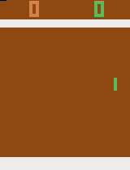

# Atari Pong DQN Experiment

A simple implementation of a Deep Q-Network (DQN) agent playing Atari Pong, inspired by [Mnih et al. (2013)](https://arxiv.org/abs/1312.5602).

## The Experiment

The goal was to see a DQN work in a classic environment using standard techniques:

- **Experience Replay**: To reuse past data and break correlation.
- **Fixed Q-Target Network**: Periodically "freezing" weights to stabilize training targets.
- **Checkpointing**: Saving progress to `checkpoints/`.

## Results

Here are some clips of the agent playing Pong at different training stages:

| Episode 1000 | Episode 2000 | Episode 3000 | Episode 4000 |
| :---: | :---: | :---: | :---: |
|  |  |  |  |

## Quick Start

### 1. Install Dependencies
Make sure you have `uv` installed, then run:
```bash
uv sync
```

### 2. Train
To start the training process (run for a few hours and forget):
```bash
uv run dql.py
```

### 3. Play
To see a trained agent in action (requires a checkpoint file):
```bash
uv run play_pong.py --checkpoint <checkpoint_name.pth>
```

### 4. Record GIFs
To generate GIFs for all checkpoints in the `checkpoints/` directory:
```bash
uv run record_gif.py
```

## Observations

### Variance and Buffer Size
- **The Challenge**: RL training can be unstable. In this implementation, the replay buffer size was a key factor.
- **Future Improvement**: Increasing the **Replay Buffer size**, **Batch size** and modifying other hyperparameters could help. A larger buffer provides a more diverse set of experiences, which usually leads to more stable gradient updates and less variance between policy versions.

I built this to put into practice what I've been learning about RL. It's a simple implementation to verify the core concepts as I start exploring this field.
